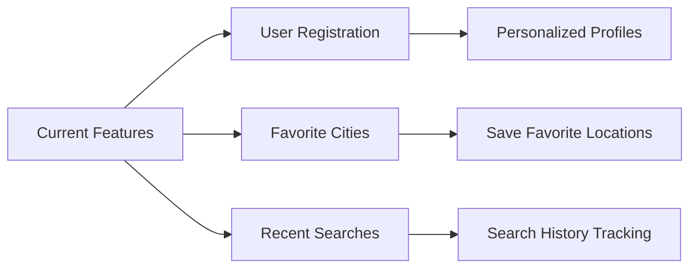

# WeatherSphere - Weather Dashboard


WeatherSphere is a modern, responsive weather dashboard that allows users to search for and view current weather conditions in cities worldwide. With its clean UI, dark/light mode toggle, and API integration, it serves as both a functional weather application and a developer tool for testing weather APIs.

> [!IMPORTANT]  
> **Upcoming Features**  
> - Favorite cities functionality  
> - Recent searches history  
> - User registration system  
> - Personalized weather preferences  

## Features

### Current Functionality
- **City Search**: Get weather by city and country
- **Detailed Weather Display**:
  - Current temperature with min/max values
  - Weather conditions and description
  - Wind speed, humidity, pressure, and visibility
- **API Console**: Real-time API request/response display
- **UI Features**:
  - Dark/Light mode toggle
  - Responsive design for all devices
  - Smooth animations and transitions
- **User Interface**:
  - Login/Registration modals
  - Favorite cities panel
  - Recent searches panel

### Planned Features


## Live Demo

[](https://codesandbox.io/p/sandbox/weathersphere-8x4c2f](https://weatherspherewebsite.netlify.app/#))

## Screenshots

| Light Mode | Dark Mode |
|------------|-----------|
| [](https://postimg.cc/KRmFk5Vs) | [](https://postimg.cc/5Yv1vKbD) |
| **Dashboard View** | **API Console** |
|  | [](https://postimg.cc/FdtX9b3p) |

## Installation

To run WeatherSphere locally:

1. Clone the repository:
```bash
git clone https://github.com/your-username/weathersphere.git
cd weathersphere
```

2. Open `index.html` in your browser

3. (Optional) Add your OpenWeatherMap API key to `js/script.js`:
```javascript
const appID = "your-api-key-here";
```

## Usage

1. Enter a city name in the search field
2. Select a country from the dropdown
3. Click "Get Weather"
4. View current weather conditions and details
5. Use the heart icon to favorite locations
6. Toggle between light/dark mode using the moon icon

## Technical Details

### Tech Stack
- **Frontend**: HTML5, CSS3, JavaScript
- **API**: OpenWeatherMap
- **Icons**: Font Awesome
- **Fonts**: Google Fonts (Poppins, Raleway)

### File Structure
```
weathersphere/
├── index.html
├── css/
│   └── style.css
├── js/
│   └── script.js
├── images/
└── README.md
```

### API Integration
```javascript
async function fetchWeatherData(city, country) {
  const appID = "your-api-key";
  const geoUrl = `https://api.openweathermap.org/geo/1.0/direct?q=${city},${country}&appid=${appID}`;
  const weatherUrl = `https://api.openweathermap.org/data/2.5/weather?lat=${lat}&lon=${lon}&appid=${appID}&units=metric`;
  
  // API calls and data processing
}
```

## Contributing

We welcome contributions! Please follow these steps:

1. Fork the repository
2. Create your feature branch (`git checkout -b feature/AmazingFeature`)
3. Commit your changes (`git commit -m 'Add some AmazingFeature'`)
4. Push to the branch (`git push origin feature/AmazingFeature`)
5. Open a Pull Request

## License

Distributed under the MIT License. See `LICENSE` for more information.

## Contact

Project Maintainer: Andres Alpizar[TheSirAndres]  
Email: joseandresalpizarmurillo0@gmail.com
Project Link: [https://github.com/TheSirAndres/weathersphere](https://github.com/TheSirAndres/weathersphere)

## Acknowledgements

- [OpenWeatherMap](https://openweathermap.org/) for their free weather API
- [Font Awesome](https://fontawesome.com/) for the beautiful icons
- [Google Fonts](https://fonts.google.com/) for the typography

> [!NOTE]
> **Development Roadmap**  
> | Feature | Status | Target Release |
> |---------|--------|----------------|
> | User Authentication | Planned | Q4 2025 |
> | Favorite Cities | In Development | Q3 2025 |
> | Recent Searches | In Development | Q3 2025 |
> | User Profiles | Planned | Q4 2025 |

---

**WeatherSphere** - Your weather, your way. Stay informed in style.
